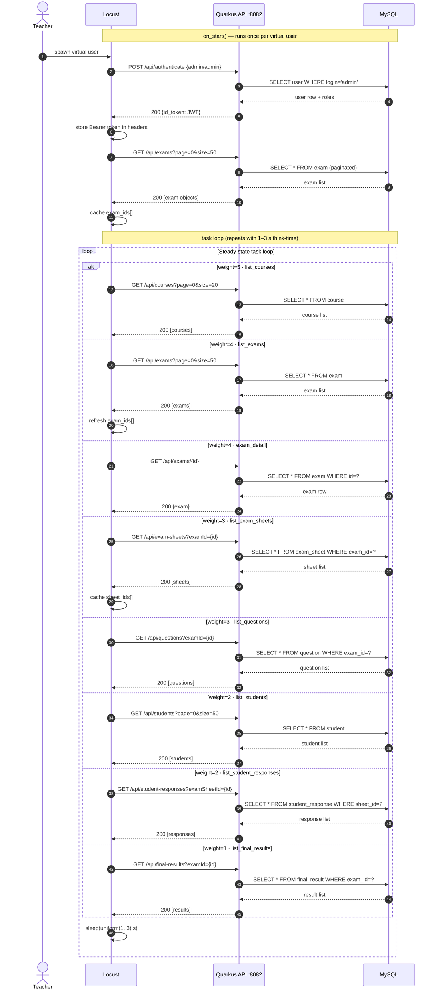
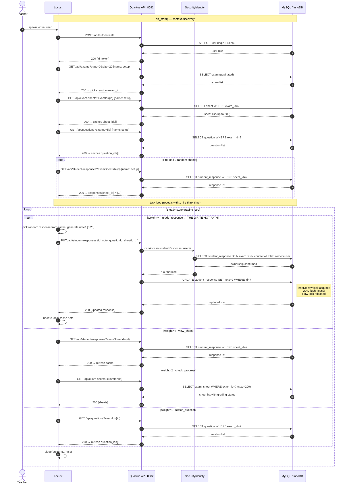
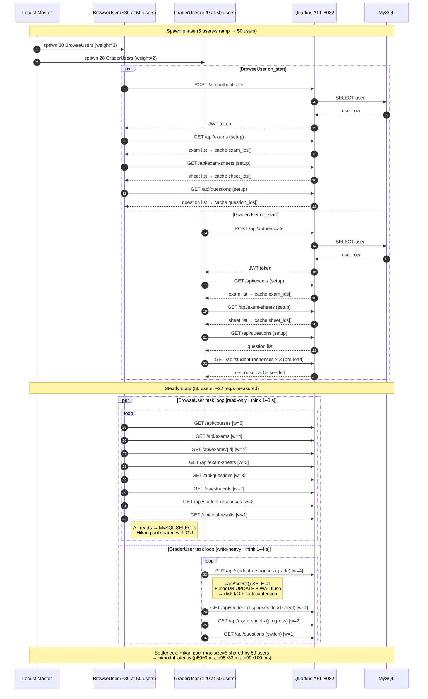

# Workload Scenarios — Sequence Diagrams

These diagrams model the three Locust scenarios under `lab/scenarios/`.
Render with any Mermaid viewer (VS Code, GitHub, mermaid.live).

---

## S01 — Browse (read-only baseline)

Simulates a teacher reviewing exam results. Pure read path, no mutations.
**50 concurrent users · think-time 1–3 s · task weights: courses×5, exams×4, exam_detail×4, sheets×3, questions×3, students×2, responses×2, final_results×1**

---

## S02 — Grade (write-heavy)

Simulates a teacher actively grading student responses. Adds write path:
`PUT /api/student-responses` triggers InnoDB row update + WAL flush + `canAccess()` DB check.
**50 concurrent graders · think-time 1–4 s · task weights: grade×4, view_sheet×4, check_progress×2, switch_question×1**

---

## S03 — Mixed (Grid5000 reference workload)

**60 % BrowseUser (weight=3) + 40 % GraderUser (weight=2)** — the scenario used
for the provisioning experiments on Grid5000. Both user types share the same `on_start()`
context-discovery sequence; they then diverge into their respective task loops.

---

## Scenario comparison table

| Dimension         | S01 Browse         | S02 Grade            | S03 Mixed (reference) |
|-------------------|--------------------|----------------------|-----------------------|
| User type         | BrowseUser only    | GraderUser only      | 60% Browse / 40% Grade|
| HTTP methods      | GET only           | GET + PUT            | GET + PUT             |
| DB operations     | SELECT only        | SELECT + UPDATE      | SELECT + UPDATE       |
| Disk I/O          | Buffer pool reads  | WAL flush per grade  | WAL flush (40% writes)|
| Lock contention   | None               | InnoDB row locks     | Row locks (40%)       |
| Sensitive IaC params | RAM (buffer pool) | Disk IOPS, vCPU, RAM | All three             |
| Grid5000 role     | Baseline reference | Write-path stress    | **Main experiment**   |
